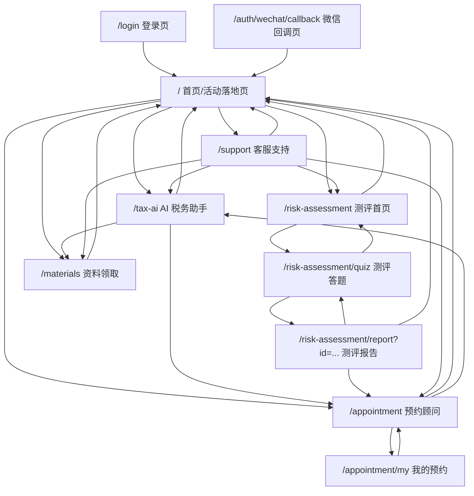
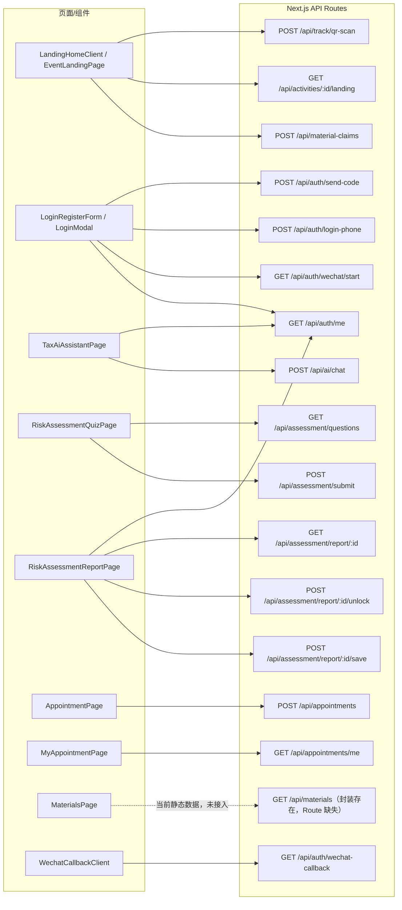
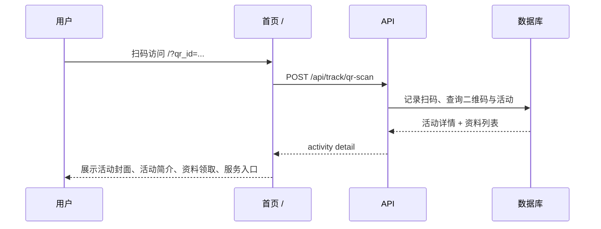
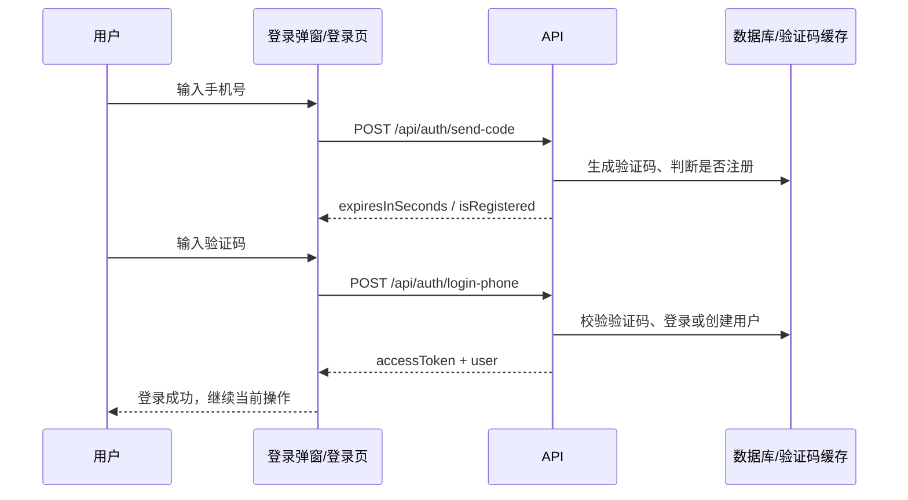
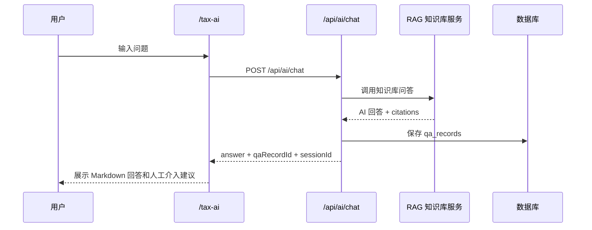
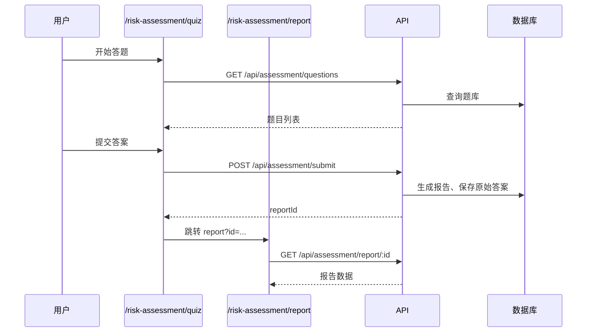
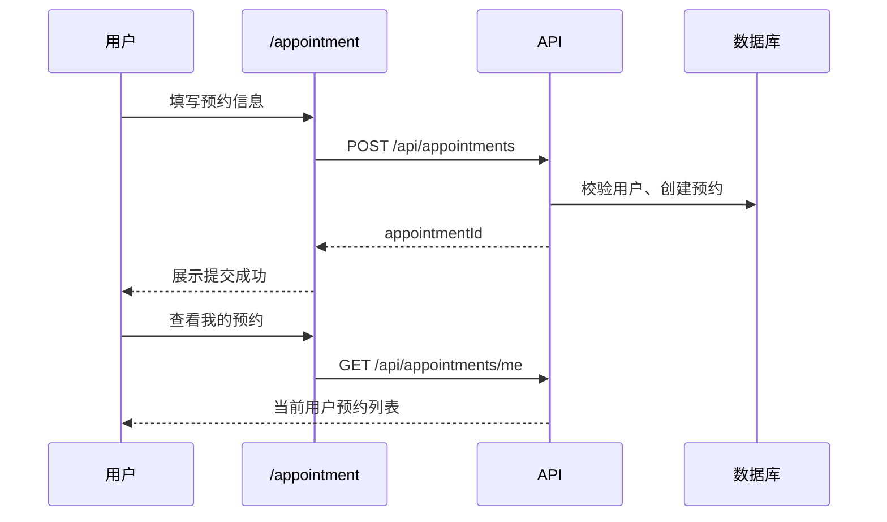
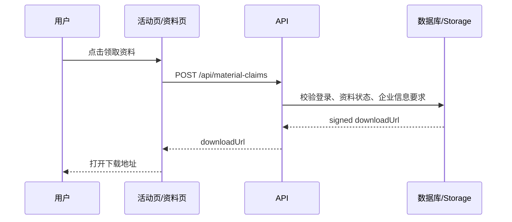

# 落地页接口与跳转逻辑图

更新时间：2026-06-22

## 1. 页面入口总览

| 页面 | 路径 | 主要用途 | 主要跳转 |
|---|---|---|---|
| 首页/活动落地页 | `/` | 通用落地页；支持 `qr_id` / `activity_id` 加载活动 | `/tax-ai`、`/risk-assessment`、`/materials`、`/support`、`/appointment` |
| 登录页 | `/login` | 手机号/微信登录入口 | 登录成功回 `/` |
| 微信回调页 | `/auth/wechat/callback` | 微信授权回调处理 | 成功后回业务页或首页 |
| AI 税务助手 | `/tax-ai` | 知识库问答 | `/appointment`、`/materials`、`/` |
| 风险测评首页 | `/risk-assessment` | 测评介绍与开始入口 | `/risk-assessment/quiz`、`/` |
| 风险测评答题 | `/risk-assessment/quiz` | 获取题目并提交答案 | `/risk-assessment/report?id=...` |
| 风险测评报告 | `/risk-assessment/report?id=...` | 查看报告、解锁、保存、预约 | `/appointment`、`/risk-assessment/quiz`、`/` |
| 资料领取页 | `/materials` | 通用资料领取展示 | 返回上一页或 `/` |
| 预约顾问页 | `/appointment` | 提交人工顾问预约 | `/appointment/my`、`/tax-ai`、`/` |
| 我的预约 | `/appointment/my` | 查看当前用户预约记录 | `/appointment`、返回上一页 |
| 客服支持 | `/support` | 固定 FAQ、留言咨询、服务入口 | `/materials`、`/risk-assessment`、`/appointment`、`/tax-ai`、`/` |

## 2. 页面跳转逻辑图

## 3. API 调用关系图

## 4. 核心业务流程图

### 4.1 活动二维码进入落地页

### 4.2 手机号登录

### 4.3 AI 问答

说明：当前落地页已具备流式读取能力，但暂时不继续优化流式效果；实际流式显示依赖 RAG HTTP 响应和部署层是否实时 flush。

### 4.4 风险测评

### 4.5 预约顾问

### 4.6 资料领取

说明：活动页资料领取已接 `POST /api/material-claims`；通用 `/materials` 页面当前仍是静态资料展示，`GET /api/materials` 客户端封装存在但 API Route 缺失。

## 5. API Route 清单

| 接口 | 方法 | 当前用途 | 登录要求 | 主要调用方 | 状态 |
|---|---|---|---|---|---|
| `/api/track/qr-scan` | POST | 上报二维码扫码并返回活动详情 | 否 | 首页二维码入口 | 已接入 |
| `/api/activities/:id/landing` | GET | 按活动 ID 获取落地页活动详情 | 否 | 首页活动入口 | 已接入 |
| `/api/auth/send-code` | POST | 发送手机号验证码 | 否 | 登录表单 | 已接入 |
| `/api/auth/login-phone` | POST | 手机号验证码登录/注册 | 否 | 登录表单 | 已接入 |
| `/api/auth/me` | GET | 获取当前用户；bypass 时返回默认用户 | 是/可 bypass | 登录态恢复、AI、报告等 | 已接入 |
| `/api/auth/wechat/start` | GET | 发起微信网页授权 | 否 | 登录表单 | 已接入 |
| `/api/auth/wechat-callback` | GET | 微信回调登录 | 否 | 微信回调页 | 已接入 |
| `/api/ai/chat` | POST | AI 知识库问答并保存记录 | 是/可 bypass | AI 税务助手 | 已接入 |
| `/api/assessment/questions` | GET | 获取测评题目 | 否 | 测评答题页 | 已接入 |
| `/api/assessment/submit` | POST | 提交测评答案并生成报告 | 是/可 bypass | 测评答题页 | 已接入 |
| `/api/assessment/report/:id` | GET | 获取测评报告 | 是/可 bypass | 测评报告页 | 已接入 |
| `/api/assessment/report/:id/unlock` | POST | 解锁完整报告 | 是/可 bypass | 测评报告页 | 已接入 |
| `/api/assessment/report/:id/save` | POST | 保存报告 | 是/可 bypass | 测评报告页 | 已接入 |
| `/api/appointments` | POST | 创建预约 | 是/可 bypass | 预约页 | 已接入 |
| `/api/appointments/me` | GET | 获取我的预约 | 是/可 bypass | 我的预约页 | 已接入 |
| `/api/material-claims` | POST | 领取资料并返回下载地址 | 是 | 活动资料领取 | 已接入 |
| `/api/materials` | GET | 获取通用资料列表 | 是/可 bypass | `/materials` 通用资料页 | 已接入 |

## 6. 当前发现的问题与建议

| 类型 | 问题 | 影响 | 建议 |
|---|---|---|---|
| 已完成 | `GET /api/materials` 已补齐，`/materials` 已接真实通用资料数据 | 管理后台上架的通用材料可同步到通用资料页 | 后续人工验证通用材料/活动绑定材料的展示边界 |
| 流式问答 | `/api/ai/chat` 已有流式兼容，但暂缓优化 | 目前可按非流式联调 | 后续确认 RAG HTTP 实时 flush 后再恢复 |
| 微信登录 | 微信入口已保留，但依赖公众号网页授权配置 | 配置不完整时无法使用微信登录 | 继续保留手机号/bypass 测试链路 |
